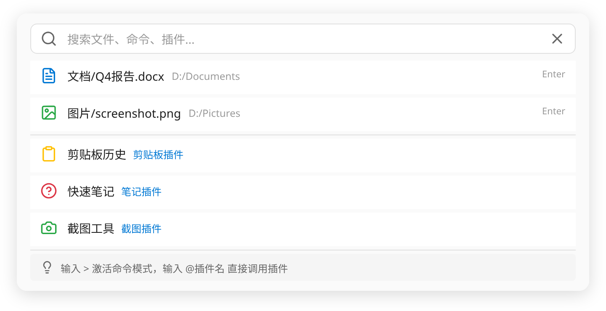

# MQBox

> 跨平台个人效率工具助手 · 极简单窗口 · 插件生态

MQBox 是一款跨平台个人效率工具助手，采用极简单窗口设计，通过全局快捷键快速呼出搜索框，提供文件搜索、插件调用、快捷操作等核心功能。作为宿主平台，所有功能以插件形式提供，支持用户自定义开发扩展。

## 截图预览



## 技术栈

| 层级 | 技术 |
|------|------|
| 主进程 | Electron 28+, TypeScript |
| 渲染进程 | Vue 3.4+, Pinia, UnoCSS, Element Plus |
| 构建工具 | Vite 5, vite-plugin-electron |
| 全局快捷键 | uiohook-napi |
| 数据存储 | lowdb (JSON 文件) |
| 测试 | Vitest |

## 快速开始

### 环境要求

- Node.js >= 18
- npm >= 9

### 安装与运行

```bash
# 1. 安装根项目依赖
npm install

# 2. 安装各插件依赖
npm run install:plugins

# 3. 开发模式启动
npm run dev

# 4. 构建打包
npm run build
```

> **注意**: `npm run dev` 使用 Vite 启动开发服务器，Electron 窗口会自动打开。热更新支持渲染进程修改。

### 构建插件（单独编译）

```bash
npm run build:plugins
```

### 运行测试

```bash
# 运行所有单元测试
npm test

# 运行特定测试文件
npx vitest run --config tests/vitest.config.ts tests/unit/pinWindow.test.ts

# 带覆盖率报告
npx vitest run --config tests/vitest.config.ts --coverage

# 观察模式（开发时）
npx vitest --config tests/vitest.config.ts
```

### CI/CD 状态

项目使用 GitHub Actions 进行持续集成，流水线包含：
1. **代码质量门禁** — ESLint 检查 + TypeScript 类型检查
2. **单元测试** — Vitest 运行核心 + 插件测试
3. **安全检查** — 扫描密钥、硬编码令牌和 TODO 遗留
4. **构建验证** — 验证主进程及所有插件可正常构建

### 插件测试（以 quick-notes 为例）

```bash
# 单独安装插件依赖
cd plugins/quick-notes && npm install

# 运行插件测试
cd plugins/quick-notes && npx vitest run

# 带覆盖率
cd plugins/quick-notes && npx vitest run --coverage

# 观察模式
cd plugins/quick-notes && npx vitest
```

## 目录结构

```
mqbox/
├── src/
│   ├── main/            # Electron 主进程
│   │   ├── index.ts     # 应用入口
│   │   ├── screenshot.ts  # 截图功能
│   │   ├── shortcut.ts  # 全局快捷键
│   │   ├── clipboardWatcher.ts  # 剪贴板监听
│   │   ├── tray.ts      # 系统托盘
│   │   ├── windowManager.ts  # 窗口管理
│   │   ├── config.ts    # 配置管理
│   │   ├── plugin/      # 插件管理系统
│   │   │   ├── host.ts  # 插件宿主
│   │   │   ├── loader.ts  # 插件加载器
│   │   │   └── sandbox.ts # 插件沙箱
│   │   └── ipc/         # IPC 通信
│   ├── preload/         # 预加载脚本
│   ├── renderer/        # Vue 渲染进程
│   │   └── src/
│   │       ├── components/  # UI 组件
│   │       └── stores/      # Pinia 状态管理
│   └── shared/          # 共享类型定义
├── plugins/             # 插件目录
│   ├── builtin/         # 内置插件
│   │   ├── todo/        # 待办事项
│   │   └── everything/  # Everything 文件搜索
│   ├── screenshot/      # 截图工具
│   ├── clipboard-history/  # 剪贴板历史
│   ├── player/          # 媒体播放器
│   ├── quick-notes/     # 快速笔记
│   └── calculator/      # 计算器
├── tests/               # 单元测试
│   ├── fixtures/        # 测试夹具
│   └── unit/            # 测试用例
└── docs/                # 文档
```

## 功能特性

- **全局快捷键** — `Ctrl+Space` 呼出搜索框，即用即走
- **文件搜索** — 集成 Everything，毫秒级文件检索
- **截图工具** — 支持区域截图、全屏截图、多显示器跨屏截图
- **剪贴板历史** — 记录并管理剪贴板内容
- **媒体播放器** — 播放本地音视频文件
- **快速笔记** — 随手记录灵感，支持笔记详情弹窗编辑
- **待办事项** — 任务管理
- **插件系统** — 支持第三方扩展开发

## 插件开发

详见 [插件开发指南](docs/plugin-development.md)

## 相关文档

| 文档 | 说明 |
|------|------|
| [PRD](docs/prd.md) | 产品需求文档 |
| [架构说明](docs/architecture.md) | 系统架构与模块设计 |
| [API 参考](docs/api.md) | 主进程 API 与 IPC 接口 |
| [插件开发指南](docs/plugin-development.md) | 插件开发教程 |
| [变更日志](docs/changelog.md) | 版本变更记录 |

## 构建发布

使用 `electron-builder` 打包：

```bash
npm run build
```

输出目录：`release/`
