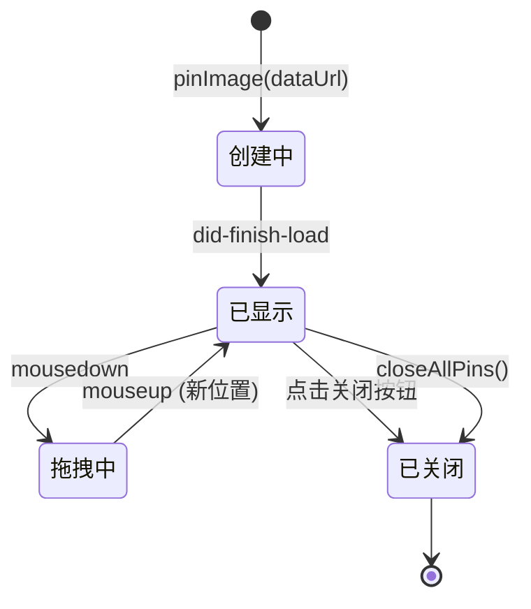

# 钉图功能 — 架构设计文档

## 1. 架构图（ASCII）

```
┌─────────────────────────────────────────────────────────────────────┐
│                         【渲染进程 - Editor.vue】                      │
│                                                                     │
│  用户点击"钉图"按钮                                                  │
│    → canvas.toDataURL('image/png')                                  │
│    → window.mqbox.screenshot.pin(dataUrl)                           │
│    → closeEditor()                                                  │
└─────────────────────────┬───────────┬───────────────────────────────┘
                          │ send      │
                          ▼           ▼
┌─────────────────────────────────────────────────────────────────────┐
│                    【主进程 - IPC Handlers】                           │
│                                                                     │
│  ipcMain.on('screenshot:pin', (_, dataUrl) => {                     │
│    pinImage(dataUrl)        ← 创建钉图窗口                           │
│  })                                                                 │
│                                                                     │
│  ipcMain.on('screenshot:pin-move', (event, x, y) => {               │
│    BrowserWindow.fromWebContents(event.sender).setPosition(x, y)    │
│  })                                                                 │
│                                                                     │
│  ipcMain.on('screenshot:pin-close', (event) => {                    │
│    BrowserWindow.fromWebContents(event.sender).close()              │
│  })                                                                 │
└─────────────────────────┬───────────┬───────────────────────────────┘
                          │ create    │
                          ▼           ▼
┌─────────────────────────────────────────────────────────────────────┐
│                    【钉图窗口 - PinWindow】                            │
│                                                                     │
│  BrowserWindow {                                                    │
│    frame: false, transparent: true, alwaysOnTop: true,              │
│    skipTaskbar: true                                                │
│  }                                                                  │
│                                                                     │
│  注入的 HTML/JS:                                                    │
│  ┌──────────────────────────────────────────────┐                   │
│  │  [×]  ← 关闭按钮（hover时显示）              │                   │
│  │                                              │                   │
│  │        截图图片（置中显示）                    │                   │
│  │                                              │                   │
│  │  ← 鼠标拖拽整窗口移动                        │                   │
│  └──────────────────────────────────────────────┘                   │
│                                                                     │
│  拖拽逻辑: mousedown → mousemove → window.mqbox.pinMove(x, y)      │
│  关闭逻辑: 点击[×] → window.mqbox.pinClose()                       │
└─────────────────────────────────────────────────────────────────────┘
```

## 2. 模块划分与接口

### 2.1 数据流：钉图工作流

```
Editor.vue                         主进程 IPC                    钉图窗口
  │                                  │                             │
  │  1.点击"钉图"                     │                             │
  ├─────────────────────────────────►│                             │
  │  screenshot:pin(dataUrl)         │                             │
  │                                  │  2.pinImage(dataUrl)        │
  │                                  ├────────────────────────────►│
  │                                  │  create BrowserWindow       │
  │                                  │  executeJavaScript(HTML)    │
  │                                  │                             │
  │                                  │   3.用户拖拽窗口            │
  │                                  │  ◄──────────────────────────┤
  │                                  │  screenshot:pin-move(x,y)   │
  │                                  │                             │
  │                                  │   4.用户点击关闭            │
  │                                  │  ◄──────────────────────────┤
  │                                  │  screenshot:pin-close()     │
  │                                  │                             │
```

### 2.2 核心数据流：窗口拖拽

```
鼠标事件                 注入的 JS                 IPC              主进程
  │                        │                      │                  │
  │ mousedown              │                      │                  │
  ├───────────────────────►│ startScreenX/Y 记录   │                  │
  │                        │ isDragging = true    │                  │
  │                        │                      │                  │
  │ mousemove              │                      │                  │
  ├───────────────────────►│ 计算 dx/dy            │                  │
  │                        │ newX = currentX + dx │                  │
  │                        │ newY = currentY + dy │                  │
  │                        ├──────────────────────► win.setPosition()│
  │                        │ pin-move(x, y)       │                  │
  │                        │                      │                  │
  │ mouseup                │                      │                  │
  ├───────────────────────►│ isDragging = false    │                  │
  │                        │                      │                  │
```

### 2.3 模块职责

| 模块 | 文件 | 职责 |
|------|------|------|
| **主进程 - 钉图管理** | `src/main/pinWindow.ts` | 创建/销毁钉图窗口，窗口移动，窗口关闭 |
| **主进程 - IPC 注册** | `src/main/ipc/index.ts` | 注册 pin-move / pin-close IPC 通道 |
| **预加载桥接** | `src/preload/index.ts` | 暴露 pinMove / pinClose 方法到渲染进程 |
| **编辑器触发** | `plugins/screenshot/src/Editor.vue` | 点击钉图按钮触发 pin |

### 2.4 IPC 接口定义

| 通道 | 方向 | 类型 | 参数 | 行为 |
|------|------|------|------|------|
| `screenshot:pin` | 编辑器→主进程 | `send` | `dataUrl: string` | 创建钉图窗口 |
| `screenshot:pin-move` | 钉图窗口→主进程 | `send` | `x: number, y: number` | 移动窗口到绝对坐标 |
| `screenshot:pin-close` | 钉图窗口→主进程 | `send` | 无 | 关闭当前钉图窗口 |
| `screenshot:close-all-pins` | 编辑器→主进程 | `send` | 无 | 关闭所有钉图窗口 (已有) |

**接口契约说明：**
- `pin-move` 使用**绝对坐标**（不是增量），由主进程负责维护窗口位置的权威状态
- `pin-close` 通过 `BrowserWindow.fromWebContents(event.sender)` 定位窗口，无需传 ID

## 3. 目录结构树（受影响文件标注）

```
mqbox/
├── src/
│   ├── main/
│   │   ├── pinWindow.ts        ← [修改] 注入含拖拽+关闭的HTML/JS
│   │   ├── ipc/
│   │   │   └── index.ts        ← [修改] 注册 pin-move / pin-close 处理
│   │   └── screenshot.ts       (不变)
│   ├── preload/
│   │   └── index.ts            ← [修改] 暴露 pinMove / pinClose 方法
│   └── renderer/               (不变)
├── plugins/
│   └── screenshot/
│       └── src/
│           └── Editor.vue      (不变 - 已有钉图按钮)
└── architecture.md             ← [新增] 本文档
```

## 4. 核心实现方案

### 4.1 `src/main/pinWindow.ts` — 修改 `pinImage()` 函数

替换现有的简单 HTML 注入为完整的交互式 HTML：

```typescript
// 核心改造: 从简单HTML注入 → 完整交互HTML
export async function pinImage(dataUrl: string): Promise<void> {
  const id = Date.now().toString()
  
  // ... 尺寸计算逻辑保持不变 ...
  
  const win = new BrowserWindow({
    width, height,
    x: Math.floor((screenWidth - width) / 2),
    y: Math.floor((screenHeight - height) / 2),
    frame: false,
    transparent: true,
    alwaysOnTop: true,
    skipTaskbar: true,
    resizable: false,     // P0不改尺寸，改false避免用户困惑
    hasShadow: false,
    webPreferences: {
      preload: join(__dirname, '../preload/index.js'),
      nodeIntegration: false,
      contextIsolation: true
    }
  })

  // ★ 注入完整交互式 HTML（含拖拽 + 关闭按钮）
  const html = generatePinHtml(dataUrl, width, height)
  win.webContents.executeJavaScript(html)
  
  win.on('closed', () => { pinWindows.delete(id) })
  pinWindows.set(id, win)
}
```

**`generatePinHtml()` 生成的 HTML 结构：**

```html
<div id="pin">
  
  <button id="close-btn">✕</button>
</div>
<script>
  // 拖拽状态
  let isDragging = false;
  let startX = 0, startY = 0;
  let winX = INITIAL_X, winY = INITIAL_Y;  // 从窗口创建位置获取

  // 鼠标按下 - 开始拖拽
  document.addEventListener('mousedown', (e) => {
    if (e.target.id === 'close-btn') return;  // 关闭按钮不触发拖拽
    isDragging = true;
    startX = e.screenX;
    startY = e.screenY;
    e.preventDefault();
  });

  // 鼠标移动 - 计算新位置
  document.addEventListener('mousemove', (e) => {
    if (!isDragging) return;
    const dx = e.screenX - startX;
    const dy = e.screenY - startY;
    winX += dx;
    winY += dy;
    startX = e.screenX;
    startY = e.screenY;
    window.mqbox?.screenshot?.pinMove(winX, winY);
  });

  // 鼠标松开 - 结束拖拽
  document.addEventListener('mouseup', () => {
    isDragging = false;
  });

  // 关闭按钮
  document.getElementById('close-btn').addEventListener('click', () => {
    window.mqbox?.screenshot?.pinClose();
  });
</script>
```

**拖拽策略选择说明：**
- ✅ 采用**增量计算 + 本地位置缓存**方案（增量法）
- 原因：渲染进程维护 `winX/winY` 本地变量，每次 mousemove 计算增量 `dx/dy` 并累加
- 主进程仅负责 `win.setPosition(x, y)`，不维护状态
- 优势：避免 IPC 往返获取窗口位置，响应更流畅

### 4.2 `src/preload/index.ts` — 新增方法

```typescript
// 在 screenshot 对象中新增:
screenshot: {
  // ... 已有方法 ...
  pin: (dataUrl: string) => ipcRenderer.send('screenshot:pin', dataUrl),
  pinMove: (x: number, y: number) => ipcRenderer.send('screenshot:pin-move', x, y),
  pinClose: () => ipcRenderer.send('screenshot:pin-close'),
  // ...
}
```

### 4.3 `src/main/ipc/index.ts` — 新增 IPC 处理器

```typescript
import { BrowserWindow } from 'electron'

// ===== 钉图窗口交互 =====

ipcMain.on('screenshot:pin-move', (event, x: number, y: number) => {
  const win = BrowserWindow.fromWebContents(event.sender)
  if (win && !win.isDestroyed()) {
    win.setPosition(Math.round(x), Math.round(y))
  }
})

ipcMain.on('screenshot:pin-close', (event) => {
  const win = BrowserWindow.fromWebContents(event.sender)
  if (win && !win.isDestroyed()) {
    win.close()
  }
})
```

## 5. 状态管理



## 6. 错误处理策略

| 场景 | 处理方式 |
|------|----------|
| `executeJavaScript` 注入失败 | `try/catch` 包裹，console.error 后关闭窗口 |
| 窗口已被销毁后收到 IPC | 通过 `!win.isDestroyed()` 守卫 |
| 拖拽时鼠标移出窗口 | 使用 `document` 级事件监听（非窗口级），确保捕获 mouseup |
| `screenshot:pin` 收到无效 dataUrl | nativeImage 会静默失败，窗口显示空白；由调用方（Editor.vue）保证 dataUrl 有效 |
| 连续快速点击钉图 | 每次独立创建新窗口，互不干扰 |

## 7. 测试矩阵

| # | 测试场景 | 验收标准 | 类型 |
|---|----------|----------|------|
| 1 | 截图编辑器点击"钉图"按钮 | 编辑器关闭，桌面出现无边框图片窗口 | 手动 |
| 2 | 钉图窗口始终置顶 | 打开其他应用窗口，钉图窗口保持最前 | 手动 |
| 3 | 鼠标拖拽窗口移动 | 按住图片任意位置拖动，窗口跟随移动 | 手动 |
| 4 | 拖拽到屏幕边缘 | 窗口可部分移出屏幕，不会卡住 | 手动 |
| 5 | 点击关闭按钮 | 窗口关闭消失 | 手动 |
| 6 | 连续钉多张图 | 多个窗口并行存在，各自独立可拖可关 | 手动 |
| 7 | 窗口无边框/无任务栏图标 | 窗口无标题栏，任务栏无对应图标 | 手动 |
| 8 | 关闭按钮 hover 显示 | 鼠标移入窗口区域才显示关闭按钮 | 手动 |

## 8. 任务分解 & 实施计划

### P0 任务（1天内交付）

| 任务ID | 文件 | 改动量 | 说明 |
|--------|------|--------|------|
| **T1** | `src/preload/index.ts` | +3行 | 新增 `pinMove` / `pinClose` 方法暴露 |
| **T2** | `src/main/ipc/index.ts` | +12行 | 注册 `screenshot:pin-move` / `screenshot:pin-close` 处理器 |
| **T3** | `src/main/pinWindow.ts` | ~80行重写 | 替换 `executeJavaScript` 的简单 HTML 为完整交互式 HTML+JS |

### 依赖关系

```
T1 (preload 新增API) ───→ T3 (pinWindow 使用API)
T2 (IPC 注册) ──────────→ T3 (pinWindow 依赖IPC就绪)
     ↑ T1 和 T2 无依赖，可并行
```

### 完成标准
- ✅ 点击钉图 → 无边框窗口出现且置顶
- ✅ 鼠标拖拽窗口任意移动
- ✅ 关闭按钮可见且点击后窗口关闭
- ✅ 连续钉多张图互不干扰

## 9. P0 代码变更预览

### 总变更统计

| 文件 | 新增 | 修改 | 删除 |
|------|------|------|------|
| `src/preload/index.ts` | 2行 | 0行 | 0行 |
| `src/main/ipc/index.ts` | 15行 | 0行 | 0行 |
| `src/main/pinWindow.ts` | ~40行 | ~30行 | ~30行 |
| **合计** | **~57行** | **~30行** | **~30行** |

### 关键设计决策（ADR）

**ADR-1: 增量坐标 vs 绝对坐标**
- 选择：增量坐标 + 本地缓存
- 理由：渲染进程维护 `winX/winY` 本地变量，避免 IPC 往返查询窗口位置
- 代价：如果窗口被外部移动（不可能，因 no-frame + alwaysOnTop），本地缓存会失步

**ADR-2: 使用 `document` 级事件 vs 窗口级事件**
- 选择：`document` 级事件监听
- 理由：鼠标移出窗口后仍需捕获 mouseup 事件，防止拖拽状态"卡死"

**ADR-3: 关闭按钮 hover 显示 vs 常显**
- 选择：hover 时显示（提高视觉纯净度）
- 实现：CSS `#close-btn { display: none; } #pin:hover #close-btn { display: block; }`
