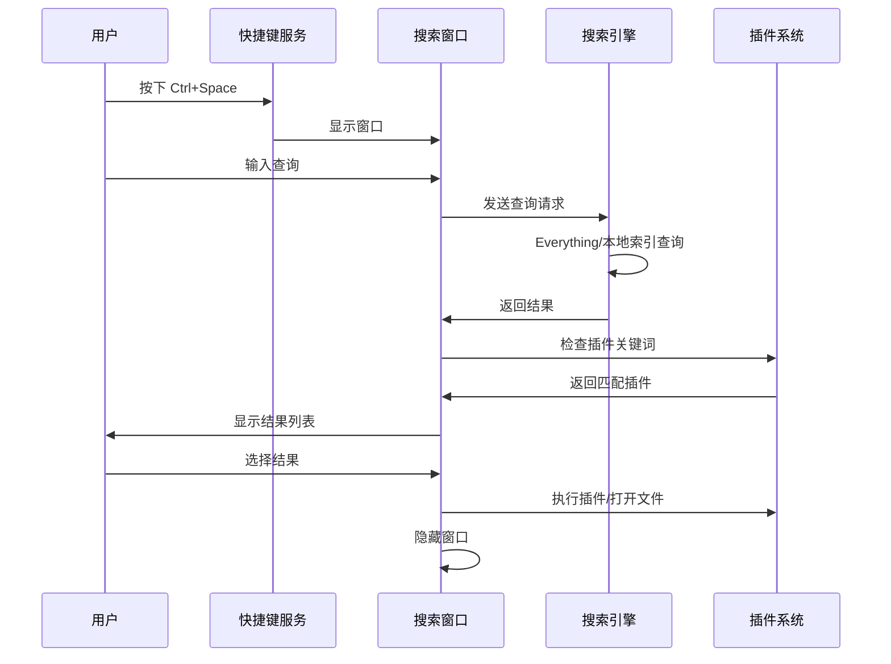
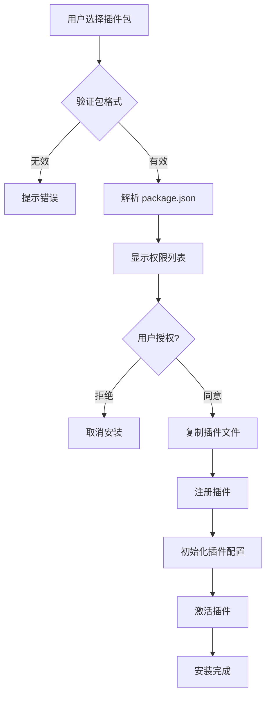

# MQBox - 个人工具助手 PRD

## 1. 产品概述

### 1.1 产品定位
MQBox 是一款跨平台个人效率工具助手，采用极简单窗口设计，通过全局快捷键快速呼出搜索框，提供文件搜索、插件调用、快捷操作等核心功能。作为宿主平台，所有功能以插件形式提供，支持用户自定义开发扩展。

### 1.2 目标用户
- 个人开发者、知识工作者
- 需要高效文件管理和快速访问工具的用户
- 希望整合多种小工具的效率追求者

### 1.3 核心价值
- **极简交互**：全局快捷键呼出，即用即走
- **插件生态**：功能模块化，按需安装
- **高效搜索**：对接Everything，毫秒级文件检索
- **跨平台**：Windows/macOS/Linux 一致体验

---

## 2. 功能架构

```
┌─────────────────────────────────────────────────────┐
│                    MQBox 宿主平台                     │
├─────────────────────────────────────────────────────┤
│  ┌─────────────────────────────────────────────┐   │
│  │           全局快捷键监听层                     │   │
│  │         (Ctrl+Space / 自定义)               │   │
│  └─────────────────────────────────────────────┘   │
├─────────────────────────────────────────────────────┤
│  ┌─────────────────────────────────────────────┐   │
│  │              搜索框核心层                     │   │
│  │  - 输入解析 → 关键词识别 → 插件路由          │   │
│  │  - 文件搜索 (Everything / 自建索引)          │   │
│  │  - 历史记录 & 智能推荐                       │   │
│  └─────────────────────────────────────────────┘   │
├─────────────────────────────────────────────────────┤
│  ┌─────────────────────────────────────────────┐   │
│  │              插件管理层                      │   │
│  │  - 插件注册/加载/卸载                        │   │
│  │  - 插件配置 & 权限管理                       │   │
│  │  - 插件市场 (可选后续版本)                   │   │
│  └─────────────────────────────────────────────┘   │
├─────────────────────────────────────────────────────┤
│  ┌─────────────────────────────────────────────┐   │
│  │              内置插件层                      │   │
│  │  剪贴板历史 │ 截图工具 │ 笔记 │ 计算器       │   │
│  └─────────────────────────────────────────────┘   │
├─────────────────────────────────────────────────────┤
│  ┌─────────────────────────────────────────────┐   │
│  │              数据持久化层                    │   │
│  │       JSON文件存储 (配置/插件数据/历史)      │   │
│  └─────────────────────────────────────────────┘   │
└─────────────────────────────────────────────────────┘
```

---

## 3. 详细功能设计

### 3.1 搜索框核心

#### 3.1.1 界面设计
```
┌────────────────────────────────────────────────┐
│ 🔍 搜索文件、命令、插件...                     │ × │
└────────────────────────────────────────────────┘
┌────────────────────────────────────────────────┐
│ 📁 文档/Q4报告.docx                    <Enter> │
│ 📁 图片/screenshot.png                <Enter> │
│ ──────────────────────────────────────────────│
│ 📋 剪贴板历史                      剪贴板插件  │
│ 📝 快速笔记                          笔记插件  │
│ 📷 截图工具                          截图插件  │
│ ──────────────────────────────────────────────│
│ 💡 输入 ">" 激活命令模式                       │
└────────────────────────────────────────────────┘
```

**窗口规格：**
- 尺寸：宽度 680px，高度自适应（最大 500px）
- 位置：屏幕顶部居中，距离顶部 15% 屏幕高度
- 样式：圆角 12px，阴影模糊 20px，半透明背景（支持毛玻璃效果）

#### 3.1.2 输入解析规则

| 输入模式 | 匹配规则 | 示例 |
|---------|---------|------|
| 纯文本 | 文件名模糊匹配 | `report` → 匹配包含report的文件 |
| `>命令` | 激活命令模式 | `>note 快速记录` |
| `@插件名` | 直接调用插件 | `@translate hello` |
| `#标签` | 搜索笔记标签 | `#important` |
| 路径格式 | 文件系统导航 | `D:/projects/` |

#### 3.1.3 文件搜索模块

**Everything集成（优先）：**
```javascript
// 通过Everything HTTP服务或SDK查询
// 需用户安装Everything并开启HTTP服务
GET http://127.0.0.1:8081/?search={query}
```

**自建索引（备选）：**
- 启动时扫描用户配置的监控目录
- 使用倒排索引 + 前缀树优化查询
- 增量更新机制（文件监听）

#### 3.1.4 快捷键配置

| 功能 | 默认快捷键 | 说明 |
|-----|----------|------|
| 呼出搜索框 | `Ctrl + Space` | 全局生效 |
| 隐藏窗口 | `Esc` | 焦点在搜索框时 |
| 确认选择 | `Enter` | 执行选中项 |
| 上下导航 | `↑` `↓` | 列表项切换 |
| 切换分类 | `Tab` | 文件/插件/命令 |

---

### 3.2 插件系统

#### 3.2.1 插件架构设计

```
插件运行时环境
├── PluginHost (主进程)
│   ├── 插件加载器
│   ├── 生命周期管理
│   └── API桥接层
├── PluginAPI (暴露给插件)
│   ├── mqbox.clipboard  - 剪贴板操作
│   ├── mqbox.files      - 文件系统
│   ├── mqbox.ui         - UI组件渲染
│   ├── mqbox.storage    - 数据存储
│   ├── mqbox.notification - 系统通知
│   └── mqbox.shell      - 系统命令
└── PluginSandbox (隔离环境)
    ├── 作用域隔离
    └── 权限控制
```

#### 3.2.2 插件包结构

```
my-plugin/
├── package.json          # 插件元信息
├── index.js              # 入口文件
├── config.schema.json    # 配置项定义
└── assets/               # 插件资源
    └── icon.png
```

**package.json 示例：**
```json
{
  "name": "my-plugin",
  "version": "1.0.0",
  "displayName": "我的插件",
  "description": "插件描述",
  "main": "index.js",
  "icon": "./assets/icon.png",
  "keywords": ["translate", "翻译"],
  "activationEvents": ["onKeyword:tr", "onCommand:translate"],
  "permissions": ["clipboard", "notification", "httpRequest"],
  "config": {
    "apiKey": { "type": "string", "title": "API密钥" }
  }
}
```

#### 3.2.3 插件生命周期

```javascript
// 插件入口文件 index.js
module.exports = {
  // 插件激活时调用
  activate(context) {
    // 注册命令
    context.registerCommand('translate', async (args) => {
      const text = args.join(' ');
      const result = await translateText(text);
      return result;
    });
    
    // 注册搜索提供者
    context.registerSearchProvider({
      keyword: 'tr',
      onSearch: async (query) => {
        return [{ title: '翻译: ' + query, action: 'translate' }];
      }
    });
  },
  
  // 插件停用时调用
  deactivate() {
    // 清理资源
  }
};
```

#### 3.2.4 插件API设计

```typescript
// 核心API接口
interface MQBoxAPI {
  // 剪贴板
  clipboard: {
    readText(): Promise<string>;
    writeText(text: string): Promise<void>;
    read(): Promise<ClipboardItem[]>;
  };
  
  // 文件系统
  files: {
    read(path: string): Promise<string>;
    write(path: string, content: string): Promise<void>;
    exists(path: string): Promise<boolean>;
    showInExplorer(path: string): void;
  };
  
  // UI组件
  ui: {
    showMessage(message: string, type?: 'info'|'error'|'success'): void;
    showInputBox(options: InputBoxOptions): Promise<string>;
    showQuickPick(items: QuickPickItem[]): Promise<QuickPickItem>;
    createPanel(options: PanelOptions): Panel;
  };
  
  // 数据存储
  storage: {
    get<T>(key: string): Promise<T>;
    set(key: string, value: any): Promise<void>;
    delete(key: string): Promise<void>;
  };
  
  // 系统通知
  notification: {
    show(title: string, body: string): void;
  };
  
  // 系统命令
  shell: {
    execute(command: string): Promise<ExecuteResult>;
    openExternal(url: string): void;
  };
}
```

#### 3.2.5 插件权限模型

| 权限标识 | 说明 | 风险等级 |
|---------|------|---------|
| `clipboard` | 读写剪贴板 | 低 |
| `notification` | 系统通知 | 低 |
| `files:read` | 读取文件 | 中 |
| `files:write` | 写入文件 | 高 |
| `httpRequest` | 发送HTTP请求 | 中 |
| `shell` | 执行系统命令 | 高 |
| `system` | 系统级操作 | 高 |

**权限审批流程：**
1. 插件安装时显示权限列表
2. 用户确认授权
3. 敏感权限运行时二次确认（可选）

---

### 3.3 内置插件

#### 3.3.1 剪贴板历史

**功能：**
- 记录最近100条剪贴板内容
- 支持文本、图片、文件路径
- 搜索过滤历史记录
- 置顶常用项

**关键词：** `cb`, `clipboard`

**使用示例：**
```
输入: cb
显示: 最近10条剪贴板记录
选择: 按 Enter 复制到剪贴板
```

#### 3.3.2 截图工具

**功能：**
- 区域截图（默认）
- 全屏截图
- 窗口截图
- 截图后标注（箭头、方框、文字）
- 一键复制/保存

**关键词：** `ss`, `screenshot`

**使用示例：**
```
输入: ss
操作: 进入截图模式，框选区域
后续: 标注 → 复制/保存
```

#### 3.3.3 快速笔记

**功能：**
- 快速记录文本笔记
- Markdown 支持
- 标签分类
- 全文搜索

**关键词：** `note`, `note`

**使用示例：**
```
输入: >note 这是今天的任务 #work
结果: 创建笔记，自动添加时间戳和标签
```

#### 3.3.4 计算器

**功能：**
- 基础数学运算
- 单位换算
- 时间计算

**关键词：** `=`, `calc`

**使用示例：**
```
输入: = 100*5+20
显示: = 520
输入: = 1km to miles
显示: = 0.621371 miles
```

---

### 3.4 插件管理器

#### 3.4.1 界面设计

```
┌────────────────────────────────────────────────────────┐
│  插件管理                                    [设置] [×] │
├────────────────────────────────────────────────────────┤
│  已安装插件 (5)                        [+ 安装插件包]  │
├────────────────────────────────────────────────────────┤
│  ┌──────────────────────────────────────────────────┐ │
│  │ 📋 剪贴板历史                    v1.0.0   [已启用] │ │
│  │ 记录和管理剪贴板历史记录                 [配置]   │ │
│  └──────────────────────────────────────────────────┘ │
│  ┌──────────────────────────────────────────────────┐ │
│  │ 📷 截图工具                      v1.0.0   [已启用] │ │
│  │ 快速截图、标注、分享                    [配置]   │ │
│  └──────────────────────────────────────────────────┘ │
│  ┌──────────────────────────────────────────────────┐ │
│  │ 📝 快速笔记                      v1.0.0   [已启用] │ │
│  │ 快速记录和管理笔记                      [配置]   │ │
│  └──────────────────────────────────────────────────┘ │
├────────────────────────────────────────────────────────┤
│  从本地安装插件包 (.mqbox-plugin 或 .zip 格式)         │
└────────────────────────────────────────────────────────┘
```

#### 3.4.2 插件配置界面

```
┌────────────────────────────────────────────────────────┐
│  📋 剪贴板历史 - 配置                         [保存] [×]│
├────────────────────────────────────────────────────────┤
│                                                        │
│  历史记录数量                                          │
│  [100           ] 条                                   │
│                                                        │
│  自动清理                                              │
│  [✓] 自动清理超过30天的记录                            │
│                                                        │
│  排除应用                                              │
│  [密码管理器, 银行应用                    ] [添加]     │
│                                                        │
│  ─────────────────────────────────────────────────    │
│  权限信息                                              │
│  • 读取剪贴板                                          │
│  • 写入剪贴板                                          │
│                                                        │
└────────────────────────────────────────────────────────┘
```

---

### 3.5 个性化设置

#### 3.5.1 设置项

| 分类 | 设置项 | 类型 | 默认值 |
|-----|-------|-----|-------|
| **快捷键** | 呼出搜索框 | 快捷键 | Ctrl+Space |
| | 确认选择 | 快捷键 | Enter |
| | 下一项 | 快捷键 | Down |
| | 上一项 | 快捷键 | Up |
| **窗口** | 窗口位置 | 选项 | 屏幕居中 |
| | 窗口宽度 | 数值 | 680px |
| | 透明度 | 滑块 | 95% |
| | 窗口置顶 | 开关 | 开启 |
| | 点击外部隐藏 | 开关 | 开启 |
| | 记住位置 | 开关 | 开启 |
| **搜索** | 默认搜索引擎 | 选项 | 文件优先 |
| | 显示数量限制 | 数值 | 10 |
| | 历史记录 | 开关 | 开启 |
| **文件搜索** | Everything集成 | 开关 | 自动检测 |
| | Everything端口 | 数值 | 8081 |
| | 监控目录 | 列表 | 用户选择 |
| **外观** | 主题 | 选项 | 跟随系统 |
| | 强调色 | 颜色 | #0078D4 |

---

## 4. 数据结构设计

### 4.1 配置文件

**路径：** `%APPDATA%/mqbox/config.json`

```json
{
  "version": "1.0.0",
  "shortcut": {
    "toggle": "Ctrl+Space",
    "confirm": "Enter",
    "next": "Down",
    "prev": "Up"
  },
  "window": {
    "width": 680,
    "opacity": 0.95,
    "alwaysOnTop": true,
    "hideOnBlur": true,
    "rememberPosition": true,
    "lastPosition": { "x": 620, "y": 200 }
  },
  "search": {
    "defaultEngine": "file",
    "maxResults": 10,
    "enableHistory": true
  },
  "fileSearch": {
    "enableEverything": true,
    "everythingPort": 8081,
    "watchDirs": ["D:/Documents", "D:/Projects"]
  },
  "theme": "auto",
  "accentColor": "#0078D4"
}
```

### 4.2 插件注册表

**路径：** `%APPDATA%/mqbox/plugins/registry.json`

```json
{
  "plugins": [
    {
      "id": "clipboard-history",
      "name": "剪贴板历史",
      "version": "1.0.0",
      "path": "./clipboard-history",
      "enabled": true,
      "installedAt": "2024-01-15T10:30:00Z",
      "config": {
        "maxHistory": 100,
        "autoCleanup": true,
        "excludeApps": ["password-manager"]
      }
    }
  ]
}
```

### 4.3 插件数据存储

**路径：** `%APPDATA%/mqbox/data/{plugin-id}/`

```
data/
├── clipboard-history/
│   └── history.json      # 剪贴板历史
├── quick-notes/
│   └── notes.json        # 笔记数据
└── settings.json         # 全局设置备份
```

---

## 5. 技术架构

### 5.1 技术栈选型

| 层级 | 技术选型 | 说明 |
|-----|---------|------|
| **框架** | Electron 28+ | 跨平台桌面应用 |
| **渲染层** | Vue 3 + TypeScript | 响应式UI |
| **UI组件** | Element Plus / Naive UI | 组件库 |
| **样式** | UnoCSS | 原子化CSS |
| **构建** | Vite + Electron Builder | 快速开发打包 |
| **状态管理** | Pinia | Vue状态管理 |
| **数据存储** | lowdb | JSON文件存储 |
| **文件监听** | chokidar | 文件系统监听 |
| **快捷键** | uiohook-napi | 全局快捷键 |

### 5.2 项目结构

```
mqbox/
├── package.json
├── electron-builder.yml        # 打包配置
├── tsconfig.json
├── vite.config.ts
├── src/
│   ├── main/                   # 主进程
│   │   ├── index.ts            # 入口
│   │   ├── ipc/                # IPC通信
│   │   ├── plugin/             # 插件系统
│   │   │   ├── loader.ts       # 插件加载器
│   │   │   ├── host.ts         # 插件宿主
│   │   │   └── sandbox.ts      # 沙箱环境
│   │   ├── search/             # 搜索引擎
│   │   │   ├── everything.ts   # Everything集成
│   │   │   └── indexer.ts      # 自建索引
│   │   ├── shortcut.ts         # 快捷键管理
│   │   └── tray.ts             # 托盘管理
│   ├── preload/                # 预加载脚本
│   │   └── index.ts
│   └── renderer/               # 渲染进程
│       ├── src/
│       │   ├── App.vue
│       │   ├── main.ts
│       │   ├── components/    # UI组件
│       │   │   ├── SearchBox.vue
│       │   │   ├── ResultList.vue
│       │   │   └── PluginManager.vue
│       │   ├── views/          # 页面
│       │   ├── stores/         # Pinia stores
│       │   ├── api/            # API封装
│       │   └── styles/         # 样式文件
│       └── index.html
├── plugins/                    # 内置插件
│   ├── clipboard-history/
│   ├── screenshot/
│   ├── quick-notes/
│   └── calculator/
└── resources/                   # 资源文件
    ├── icon.png
    └── tray-icon.png
```

### 5.3 IPC通信设计

```typescript
// IPC频道定义
const IPC_CHANNELS = {
  // 搜索相关
  'search:query': (query: string) => SearchResult[],
  'search:file': (query: string) => FileResult[],
  
  // 插件相关
  'plugin:list': () => PluginInfo[],
  'plugin:enable': (id: string) => void,
  'plugin:disable': (id: string) => void,
  'plugin:install': (path: string) => PluginInfo,
  'plugin:uninstall': (id: string) => void,
  'plugin:execute': (id: string, action: string, args: any) => any,
  
  // 配置相关
  'config:get': (key: string) => any,
  'config:set': (key: string, value: any) => void,
  
  // 窗口相关
  'window:show': () => void,
  'window:hide': () => void,
  'window:setPosition': (x: number, y: number) => void,
  
  // 剪贴板相关
  'clipboard:read': () => string,
  'clipboard:write': (text: string) => void,
};
```

---

## 6. 用户流程

### 6.1 主流程



### 6.2 插件安装流程



---

## 7. 版本规划

### 7.1 MVP版本 (v1.0)

**目标：** 核心功能可用

| 功能 | 优先级 | 状态 |
|-----|-------|------|
| 全局快捷键呼出 | P0 | 待开发 |
| 极简搜索框UI | P0 | 待开发 |
| Everything文件搜索集成 | P0 | 待开发 |
| 插件加载框架 | P0 | 待开发 |
| 剪贴板历史插件 | P1 | 待开发 |
| 截图工具插件 | P1 | 待开发 |
| 快速笔记插件 | P1 | 待开发 |
| 插件管理器 | P1 | 待开发 |
| 基础设置 | P1 | 待开发 |
| 托盘运行 | P1 | 待开发 |

### 7.2 后续版本

| 版本 | 功能规划 |
|-----|---------|
| v1.1 | 自建文件索引、计算器插件、主题商店 |
| v1.2 | 插件市场、云端同步、多语言支持 |
| v1.3 | AI助手集成、工作流自动化 |

---

## 8. 开发规范

### 8.1 命名规范

- **项目名称：** MQBox
- **包名：** mqbox
- **可执行文件：** MQBox.exe (Windows), MQBox (macOS/Linux)
- **配置目录：** `%APPDATA%/mqbox/`
- **插件目录：** `%APPDATA%/mqbox/plugins/`

### 8.2 插件开发规范

- 插件必须包含 `package.json` 和 `index.js`
- 插件ID使用 kebab-case 命名
- 插件必须声明所需权限
- 插件必须处理 `activate` 和 `deactivate` 生命周期

### 8.3 代码规范

- TypeScript strict mode
- ESLint + Prettier 代码格式化
- Git commit 遵循 Conventional Commits
- 组件使用 Vue 3 Composition API

---

## 9. 风险与应对

| 风险 | 影响 | 应对措施 |
|-----|-----|---------|
| Everything服务不可用 | 文件搜索功能受限 | 降级到自建索引，提示用户安装Everything |
| 插件安全风险 | 恶意插件可能危害系统 | 权限审批机制，敏感操作二次确认 |
| 快捷键冲突 | 与其他软件冲突 | 允许自定义快捷键，启动时检测冲突 |
| 跨平台兼容性 | 不同系统行为差异 | 使用条件编译，平台特定代码隔离 |
| Electron包体积大 | 安装包较大 | 使用 asar 压缩，按需加载插件 |